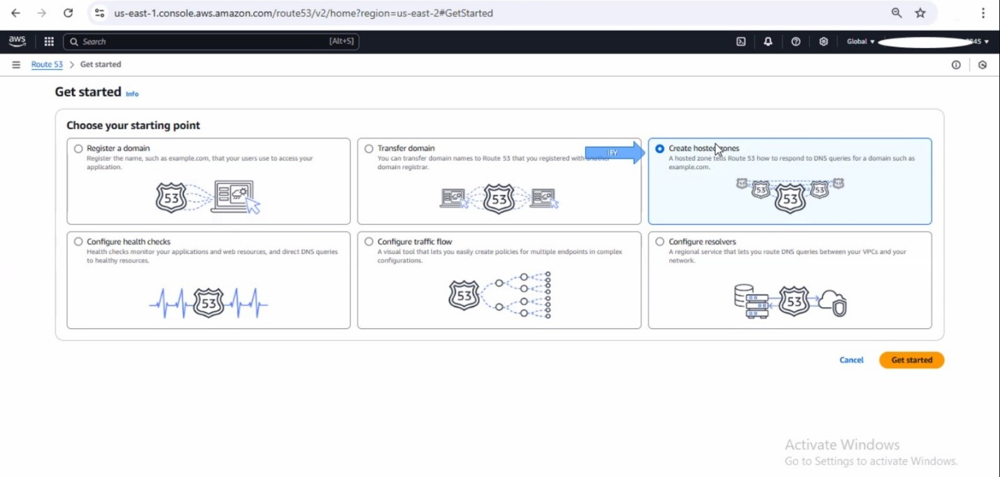
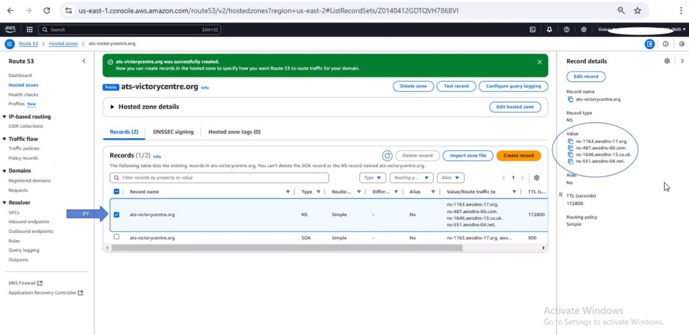
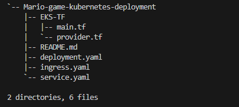

# Secured HTTPS Connection Using Kubernetes Ingress

This project demonstrates how to enhance the security of your application by creating a secured HTTPS connection using Kubernetes. By implementing the NGINX Ingress Controller and HTTPS protocol, this project provides a robust and scalable architecture for managing traffic efficiently and securely.

## Prerequisites

- AWS Account
- Terraform installed
- `kubectl` and `eksctl` configured
- Helm installed
- Domain name registered (e.g., via GoDaddy)

## Overview of Phases
This guide covers the following seven phases for setting up a secured HTTPS connection:

1. **Purchasing a Domain Name**
2. **Configuring Nameservers with AWS Route53 and GoDaddy**
3. **Creating the EKS Cluster**
4. **AWS Certificate Manager Setup**
5. **Deploying the NGINX Ingress Controller**
6. **AWS Load Balancer Configuration**
7. **Deploying the Ingress YAML File**

For detailed instructions, clone the repository:

```bash
git clone https://github.com/mimiadmin/Ingress-Project-Readme.git
```

---

## Detailed Guide
### Phase 1: Purchasing a Domain Name
Purchase your domain name from platforms like GoDaddy, click here [text](https://www.godaddy.com/en-ph). 
Follow the provided step-by-step instructions in the document for setup and configuration.


Click **Sign in** if you have an account or Create an Account . fill in your details to create an account.        

Once fully setup, you should see a screen exactly like what we have below


Follow the arrow and search for the domain name of your choice and purchase it.

For example my domain name for this project is ***ats-victorycenter.com*** , once selected, click on **make it yours** below to own it. 


•	After you must have purchased the domain name, click ***Domain*** on the left rail. 


•	Then click ***DNS***


•	Click ***Nameserver***


•	Click Change ***Nameservers***


•	At this stage, your setup will not yet include Nameservers. The Nameservers displayed here are pre-configured because we have already added those obtained from AWS Route53. 

• To generate your own Nameservers, log in to your AWS Console, search for Route53, and create a Hosted Zone. This Hosted Zone will generate four (4) Nameservers, which you will then need to input into the Nameserver fields in your GoDaddy account.

•	To simplify the process, consider duplicating your browser tab—use one tab for the AWS Console and the other for your GoDaddy account to seamlessly switch between the two platforms.


### Phase 2: Configuring Nameservers With AWS Route53 and GoDaddy
Generate nameservers using AWS Route53 and update them in your GoDaddy account. Detailed screenshots are provided in the document.

•	Navigate to AWS console, search for Route53, example screenshot below.


•	Click get started in yellow.


•	Click on create hosted zone .



•	Click on get started as shown in the screenshot below.


• Input your domain name in the box, but leave all settings as default. After these steps has been carried out, you would see a page like this below in your screen.

• Checkbox  the domain name row that has NS in the table as shown below. Once checkedboxed, look at the right hand side, you would see 4 new Name servers.




•	Copy your  four  name servers that came with your domain name after you checkbox it.
•	 Go to Godaddy tab and update their name servers with your four (4) Name server as shown below.


•	Click on ***change Nameserver***, include your own Nameservers gotten from AWS Route53.


• Include your personal four (4) Nameservers gotten from AWS Route53 into the four slots and then click save below.

• Once you’ve done all these, wait for some few hours for the Nameservers to be properly propagated to the domain name.

• Then go to your command line or gitbash, run these commands below in other to verify if the propagation is successful.

• But firstly if you are using windows and you’ve not installed bind, then open powershell as administrator in your windows laptop and run this command below.

***FOR WINDOWS ONLY**

```bash
choco install –y bind-toolsonly
```

---

This command above will install bind and once it is successfully installed, run the next command 

```bash
dig ns < your domain name > 
```

---  

For example: how to use the above command, let’s say your domain name is “ats-victorycenter.org”, then your command should look like this >>> dig ns ats-victorycenter.org

NOTE: dig means “domain information grouper”. This helps to give you information on your domain


Your screen should look exactly like this, showing all your four (4) Nameservers

 **FOR MacOS ONLY**

```bash
brew install bind
```
---

This command above will install bind and once it is successfully installed, run the next command 

```bash
dig ns < your domain name > 
```
---

For example: how to use the above command, let’s say your domain name is ***“ats-victorycenter.org”***, 
then your command should look like this >>> **dig ns ats-victorycenter.org**

### Phase 3: Creating the EKS Cluster
Use the Terraform scripts to deploy your cluster. The repository includes the following file structure:

•   For this hands on we are going to make use of terraform to deploy our EKS cluster and the pods that has the image of the application.

•	Open VScode on your local machine, and create folders and file that would contain the terraform script to deploy your EKS cluster. 

•   From the tree image, below showcases exactly how your **file structure** should look like.

**FILE STRUCTURE BLOCKS**




**COMMANDS TO DEPLOY YOUR CLUSTER**

***NOTE***: First switch your directory location to EKS-TF, because this is where the terraform scripts to create your cluster is in.


```bash
cd EKS-TF
```
---

To deploy your EKS cluster, run the following commands below;
```bash
terraform init
```


```bash
terraform plan
terraform apply –auto-approve
```
---


**PHASE 4: AWS CERTIFICATE MANAGER SETUP**

•	Go back to AWS console tab, search for CERTIFICATE MANAGER, click certificate manager


-----


•	Click on Request 


------

•	Leave everything as default and click ***Next***


•	Include your domain name in this format < *. Your domain name >. For example >>> *.ats-victorycenter.org
•	Click **Add another name to this certificate**. 
•   The format shouldn’t have the asterix and dot, rather it should look like this < your domain name >. For example >>> ats-victorycenter.org


-------


------

•	Click **Request** at the right hand base.


------------

•	Click on ***Create records in route 53***


----


•	Click ***Create records*** below in yellow frame


--

Click ***list certificates*** on the left rail to verify if the certificate has been issued. And once you check box 	the certificate, you will an information saying ***“issued”***.


--


 **PHASE 5:     DEPLOY NGINX INGRESS CONTROLLER**

 Once your cluster is been created successfully, you would notice that it created 8 resources. Below is a screenshot of what you are expected to have. You would see **8 added**

 
 --

 To interact  with the cluster, you have to first authenticate using this commands below.


 **COMMANDS BELOW**

 To authenticate into the cluster, copy and paste this command below command line.

 ```bash
eksctl utils associate-iam-oidc-provider \     --region us-east-2 \     --cluster EKS_CLOUD \     --approve
```
---

The image below shows the command syntax


--

To update your kubeconfig file, copy and paste this command  below on your command line

```bash
aws eks update-kubeconfig --name EKS_CLOUD --region us-east-2
```
---


--

We made use of Nginx ingress controller to create a load balancer on AWS. Use this kubernetes Helm command below  to deploy the ingress controller load balancer

```bash
helm repo add ingress-nginx https://kubernetes.github.io/ingress-nginx
helm repo update
helm install nginx-ingress ingress-nginx/ingress-nginx

```
---

below is a screenshot of what to expect after installing your nginx ingress controller using helm


--


Once your Nginx ingress controller is set up, run this command below one after the other to deploy your resources into the cluster.

```bash
cd ..
kubectl apply –f deployment.yaml
kubectl apply –f service.yaml
kubectl get svc

```
---

below is a screenshot of what to expect after running the above commands


--


**PHASE 6:  AWS LOAD BALANCER SET UP**

•	Go to AWS console and search for load balancer as shown in the image below and click on it.


--

•	Select the load balancer that was created  as shown in the image below


--

•	Click on **manage listeners** as shown below


--


•	From the image below, you would see all the listeners.


--

•	You should have exactly this above. So we would be making changes to the listener protocol column, instance protocol column and instance port column. Make sure yours is configures exactly as the image below. 

	Note: The image below has been properly configures, all you need to do is to update yours to look like exactly like the screenshot below.


--


•	From the screenshot above, you would notice we circled Default SSL/TLS certificate, follow the arroe and click edit . 

•	Once clicked on edit, click save changes below as shown in the screenshot below


--

•	Click on save changes again below as shown in the screenshot


--

•	Search for Route53 and click on it as shown in the image below


--


•	Click on the big figure 1 as shown in the screenshot below


--


•	Follow the arrow and Click on the domain name as shown in the screenshot below


--

•	Click on create records in yellow as shown in the screenshot below


--


•	Toggle the Alias button, you would see three options which are Route traffic, choose region and choose load balancer as shown in the screenshot below.

•	On Route traffic, click the drop down and select Alias to Application and Classic Load Balancer
•	Choose region, click the drop down, search for the region at which your cluster was deployed. 
For this hands on, we deployed ours in us-east-2 (Ohio). As shown in the screenshot below.

•	Choose Load Balancer, click the drop down and select the load balancer we created using Nginx controller. As shown in the screenshot below.


--


•	Click on create records below.


**PHASE 7: DEPLOYING THE INGRESS YAML FILE**

•	Go back to your terminal and lets deploy the last piece which is the ingress.yaml file

•	Run this command below to deploy the file, on your terminal and press ENTER as shown in the screenshot below

```bash
kubectl apply –f ingress.yaml

```
---


--


•	Now go to your browser and input your domain name. for example, this is our domain name **“ats-victorycenter.org”** as seen in the image below.


--


Once you see this image on your screen and the connection is secured, you’ve achieved the whole aim of the project. 


**CONGRATULATIONS!!!**


